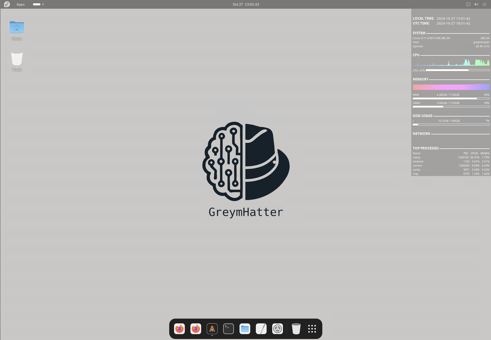

# GreymHatter

## Description

**GreymHatter** is a digital forensics and incident response distribution based on Fedora Linux. Primarily developed as a teaching platform, GreymHatter incorporates several forensics tools and shortcuts into one system, streamlining key processes like:

- Timeline development and analysis
- System log analysis
- Memory analysis
- Open Source Intelligence gathering
- Cyber Threat Intelligence utilization

## Legal

This platform was developed for instructional purposes and has not been tested in a production environment. The authors and maintainers of this project are not responsible for loss of data or productivity while using this product.

## Key Features

GreymHatter is built on the Fedora Workstation Linux distribution with the Gnome desktop environment. It uses the Docker container environment to house several applications. Furthermore, several forensic tools have been installed and configured. Tools installed include:

| Name              | Purpose                                              | Type      | Local Access           | Website                                 |
| ----------------- | ---------------------------------------------------- | --------- | ---------------------- | --------------------------------------- |
| cyberchef         | Self-hosted data operations site                     | Container | http://localhost:8080  | https://cyberchef.org/                  |
| homepage          | Self-hosted homepage for all sites                   | Container | http://localhost:3000  | https://gethomepage.dev/                |
| maxmind-geoupdate | Updates GeoIP databases every day (requires API key) | Container | -                      | https://www.maxmind.com/en/home         |
| spiderfoot        | OSINT gathering platform                             | Container | http://localhost:5001  | https://github.com/smicallef/spiderfoot |
| timesketch        | Forensic timeline analysis tool                      | Container | https://localhost      | https://timesketch.org/                 |
| yeti              | Cyber Threat Intelligence platform                   | Container | https://localhost:8888 | https://yeti-platform.io/               |

Other tools included are:

| Name        | Purpose                                              | Website                                             |
| ----------- | ---------------------------------------------------- | --------------------------------------------------- |
| capa        | Mandiant file capability detector                    | https://github.com/mandiant/capa                    |
| dfiq        | Digital Forensics Investigative Questions            | https://dfiq.org/                                   |
| floss       | Mandiant FLARE Obfuscated String Solver              | https://github.com/mandiant/flare-floss             |
| hayabusa    | Windows Event Log Analysis                           | https://github.com/Yamato-Security/hayabusa         |
| powershell  | Powershell core for Linux                            | --                                                  |
| sleuthkit   | For analyzing disk images                            | https://sleuthkit.org/                              |
| volatility2 | Memory analysis for legacy systems                   | https://github.com/volatilityfoundation/volatility  |
| volatility3 | Memory analysis platform with JPCERT/CC symbols      | https://github.com/volatilityfoundation/volatility3 |
| vt-cli      | VirusTotal Command Line Interface (requires API key) | https://virustotal.github.io/vt-cli/                |

## Download

Download the latest OVF version here.

| Name         | Architecture | Link                                                                                                                                                                     |
| ------------ | ----| ------------------------------------------------------------------------------------------------------------------------------------------------------------------------ |
| VM        | x86_64/AMD64 | [https://cc-public.s3.us-east-1.amazonaws.com/GreymHatter-F40-Gnome-20241024.zip](https://cc-public.s3.us-east-1.amazonaws.com/GreymHatter-F40-Gnome-20241024.zip)       |
| VM Hashes | x86_64/AMD64 | [https://cc-public.s3.us-east-1.amazonaws.com/GreymHatter-F40-Gnome-20241024.sha256](https://cc-public.s3.us-east-1.amazonaws.com/GreymHatter-F40-Gnome-20241024.sha256) |
| VM        | ARM64        | [https://cc-public.s3.us-east-1.amazonaws.com/greymhatter-f41-gnome-arm64.zip](https://cc-public.s3.us-east-1.amazonaws.com/greymhatter-f41-gnome-arm64.zip) |
| VM Hashes | ARM64        | [https://cc-public.s3.us-east-1.amazonaws.com/greymhatter-f41-gnome-arm64.sha256](https://cc-public.s3.us-east-1.amazonaws.com/greymhatter-f41-gnome-arm64.sha256) |

Once downloaded, verify the zip file with the hash file using `sha256sum` or any other hashing program.

```shell
# On Linux
sha256sum -c GreymHatter-F40-Gnome-20241024.sha256

# Powershell
Get-Filehash GreymHatter-F40-Gnome-20241024.zip
Get-Content GreymHatter-F40-Gnome-20241024.sha256
```

Finally, unzip the file and import the OVF into your virtual machine software.

## Installation

If you choose to do a fresh installation, begin by installing Fedora Linux 40 with Gnome Desktop. Then fully update the system using

```shell
sudo dnf upgrade --refresh -y
```

Once completed, download this project and run the `setup.sh` script as the root user.

```shell
git clone https://github.com/jknyght9/greymhatter.git
cd greymhatter
bash setup.sh
```

This process takes a while as it is installing the various platforms, compiling volatility's symbol tables, and compiling sluethkit. Once completed, reboot the system.

## Default Login

The default login for the system, Timesketch, and Yeti is:

```text
username: hatter
password: H@tt3r123!
```

> **Note**: during the Samba (Windows share) setup, you will be asked to set a password. Remember this if you plan on using the Samba share on a Windows system.

## Screeshots

**Desktop**



**Fish Terminal with TMUX, BTOP, and CTOP**


**Homepage**


**Timesketch**


**Yeti Threat Intelligence**


**Spiderfoot**


## References

[https://google.github.io/osdfir-infrastructure/](https://google.github.io/osdfir-infrastructure/)
